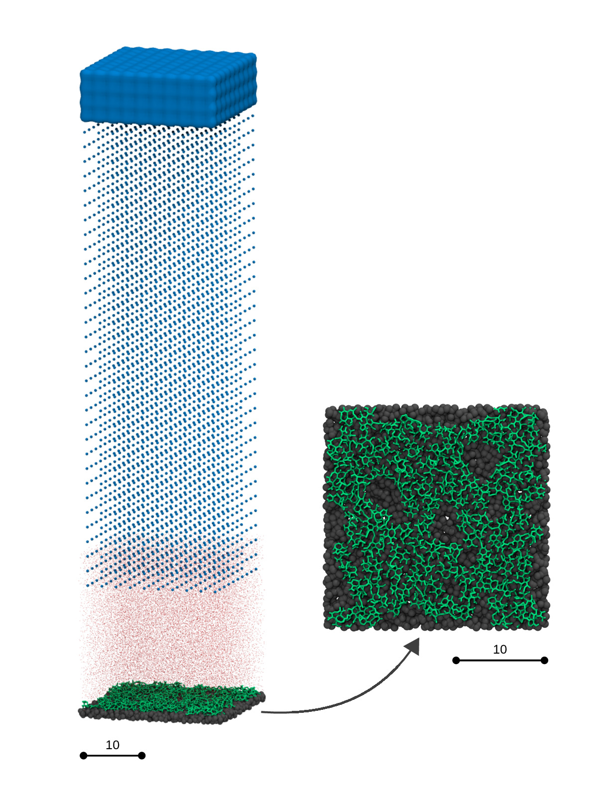

# MUI - Multiscale Universal Interface
Concurrently coupled numerical simulations using heterogeneous solvers are powerful tools for modeling multiscale phenomena. However, major modifications to existing codes are often required to enable such simulations, posing significant difficulties in practice. Here we present Multiscale Universal Interface (MUI), which is capable of facilitating the coupling effort for a wide range of multiscale simulations. The library adopts a header-only form with minimal external dependency and hence can be easily dropped into existing codes. A data samplerconcept is introduced, combined with a hybrid dynamic/static typing mechanism, to create an easily customizable framework for solver-independent data interpretation. The library integrates MPI MPMD support and an asynchronous communication protocol to handle inter-solver information exchange irrespective of the solvers’ own MPI awareness. Template metaprogramming is heavily employed to simultaneously improve runtime performance and code flexibility. We validated the library by solving three different multiscale problems, which also serve to demonstrate the flexibility of the framework in handling heterogeneous models and solvers. In the first example, a Couette flow was simulated using two concurrently coupled Smoothed Particle Hydrodynamics (SPH) simulations of different spatial resolutions. In the second example, we coupled the deterministic SPH method with the stochastic Dissipative Particle Dynamics (DPD) method to study the effect of surface grafting on the hydrodynamics properties on the surface. In the third example, we consider conjugate heat transfer between a solid domain and a fluid domain by coupling the particle-based energy-conserving DPD (eDPD) method with the Finite Element Method (FEM).

## Licensing

The source code is dual-licensed under both the GNU General Purpose License v3 and Apache License, version 2.0.

## Publication

**Tang** Y.-H., **Kudo**, S., **Bian**, X., **Li**, Z., & **Karniadakis**, G. E. Multiscale Universal Interface: A Concurrent Framework for Coupling Heterogeneous Solvers, *Journal of Computational Physics*, **2015**, 297.15, 13-31.

## Contact

Should you have any question please do not hesitate to contact the developers, a list can be found within the MxUI GitHub organisation pages https://github.com/MxUI

## Examples

| Concurrently coupled simulation of conjugate heat transfer using Finite Element (FEM) - Dissipative Particle Dynamics (DPD) |
|:------------------------------------------------------------------------------------------------------------------:|
|                                                                            |

| DPD-SPH coupled simulation of flow past polymer-grafted surface |
|:------------------------------------------------------------------------------------------------------------------:|
||
