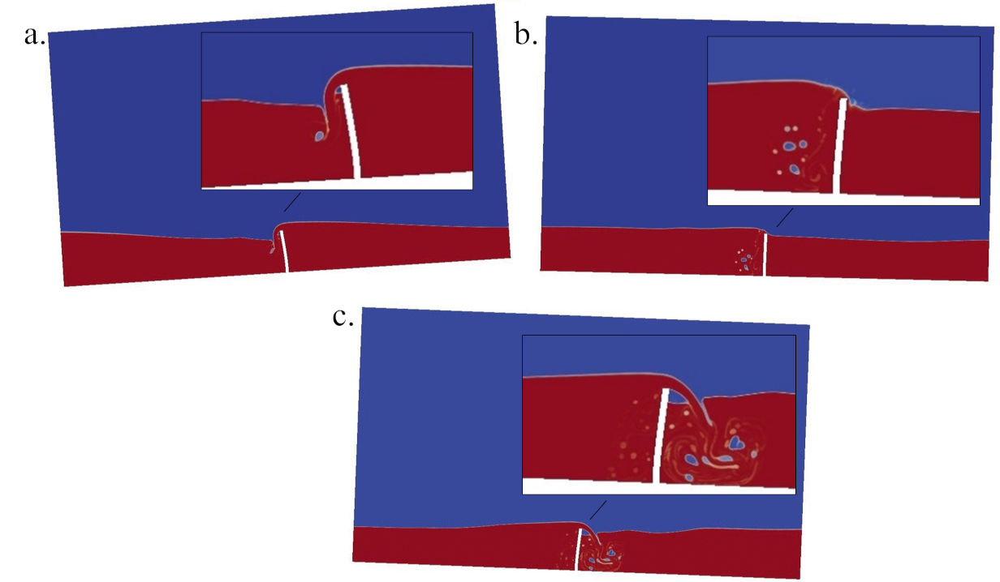
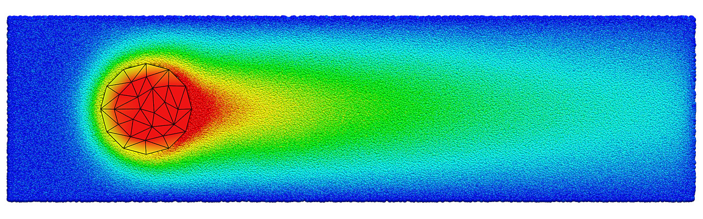

# MUI - Multiscale Universal Interface
Concurrently coupled numerical simulations using heterogeneous solvers are powerful tools for modeling both multiscale and multiphysics phenomena. However, major modifications to existing codes are often required to enable such simulations, posing significant difficulties in practice. Here we present the Multiscale Universal Interface (MUI), which is capable of facilitating the coupling effort for a wide range of simulation types. 

The library adopts a header-only form with minimal external dependency and hence can be easily dropped into existing codes. A data sampler concept is introduced, combined with a hybrid dynamic/static typing mechanism, to create an easily customizable framework for solver-independent data interpretation. 

The library integrates MPI MPMD support and an asynchronous communication protocol to handle inter-solver information exchange irrespective of the solvers’ own MPI awareness. Template metaprogramming is heavily employed to simultaneously improve runtime performance and code flexibility. 

In the publication referenced below, the library is validated by solving three different multiscale type problems, which also serve to demonstrate the flexibility of the framework in handling heterogeneous models and solvers associated with multiphysics problems. In the first example, a Couette flow was simulated using two concurrently coupled Smoothed Particle Hydrodynamics (SPH) simulations of different spatial resolutions. In the second example, we coupled the deterministic SPH method with the stochastic Dissipative Particle Dynamics (DPD) method to study the effect of surface grafting on the hydrodynamics properties on the surface. In the third example, we consider conjugate heat transfer between a solid domain and a fluid domain by coupling the particle-based energy-conserving DPD (eDPD) method with the Finite Element Method (FEM).

## Licensing

The source code is dual-licensed under either the GNU General Purpose License v3 or Apache License v2.0, copies of both licenses should have been provided along with this source code.

## Installation

MUI is a C++ header-only library with one dependency - an MPI implementation that supports the MPMD paradigm.

Wrappers are provided for C, Fortran and Python, these require compilation and therefore when using MUI with any of thee languages the library can no longer be considered header-only.

As a header-only library using MUI in your own source code is straight forward, there are two ways to utilise the library in this scenario:

1. Include "mui.h" in your code and add appropriate paths to your compiler, if you wish to utilise a wrapper then go to the /wrappers folder and utilise the Makefile build system in each to generate compiled libraries to link against, any associated header files are also located here.
1. (preferred) Utilise the provided CMake build files to create a local or system-wide installation of the library. In this case there are a number of CMake parameters you should consider:
      1. CMAKE_INSTALL_PREFIX=[path] - Set the path to install the library, otherwise the system default will be used
      2. CMAKE_BUILD_TYPE=Release/Debug/.. - Set the compilation type (only changes options for compiled wrappers)
      3. C_WRAPPER=ON/OFF - Specifies whether to compile the C wrapper during installation
      4. FORTRAN_WRAPPER=ON/OFF - Specifies whether to compile the Fortran wrapper during installation
      5. PYTHON_WRAPPER=ON/OFF - Specifies whether to compile and install the Python wrapper during installation, relies on a working Python3 toolchain and uses pip

## Publication

**Tang** Y.-H., **Kudo**, S., **Bian**, X., **Li**, Z., & **Karniadakis**, G. E. Multiscale Universal Interface: A Concurrent Framework for Coupling Heterogeneous Solvers, *Journal of Computational Physics*, **2015**, 297.15, 13-31.

## Contact

Should you have any question please do not hesitate to contact the developers, a list can be found within the MxUI <a href="https://mxui.github.io/about.html" target="_blank">about</a> page.

## Examples

| Computational Fluid Dynamics (CFD) - Finite Element (FEM) Fluid Structure Interaction |
|:------------------------------------------------------------------------------------------------------------------:|
| |

| Finite Element (FEM) - Dissipative Particle Dynamics (DPD) Conjugate Heat Transfer |
|:------------------------------------------------------------------------------------------------------------------:|
|  |

| Dissipative Particle Dynamics (DPD) - Smoothed Particle Hydrodynamics (SPH) flow past a polymer-grafted surface |
|:------------------------------------------------------------------------------------------------------------------:|
| |
